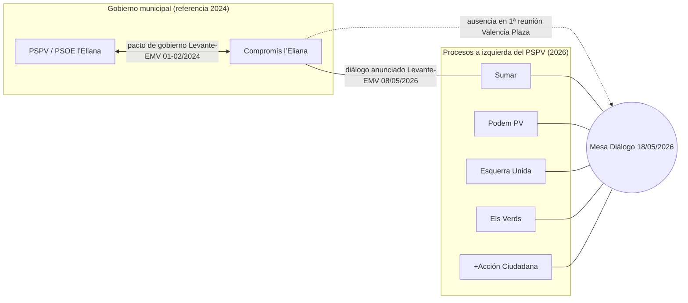

# Cronología — Fragmentación y confluencias a la izquierda del PSPV en l’Eliana (2015–2027)

Archivo interno. **No** es contenido editorial público. Objetivo: ordenar hitos públicos relacionados con divisiones, pactos y procesos de unidad entre espacios habitualmente situados en el campo progresista / a la izquierda del PSOE en el municipio.

**Convención de nomenclatura:** este documento no asume afiliaciones no contrastadas; cuando la prensa cita siglas o marcas electorales, se reproducen como **declaración del medio** o **hecho explícito** según corresponda.

---

## Resumen tabular (hitos citados en este archivo)

| Año | Hecho público principal (resumen documental) | Documentos relacionados |
|-----|-----------------------------------------------|-------------------------|
| 2015 | Información en medios locales sobre relación candidatura / espacio Compromís y figura Montaner (requiere revisión del artículo citado; ver *Límites*) | [M. J. Montaner](../personas/maria-jose-montaner.md) |
| 2016 | Sentencia de absolución en procedimiento que afectó a concejala de Compromís | [Compromís](../partidos/compromis.md), [M. J. Montaner](../personas/maria-jose-montaner.md) |
| 2023 (28M) | Resultados y oferta de pacto del alcalde socialista hacia Compromís; marco de fragmentación/confluencias locales | [PSPV](../partidos/pspv.md), [Compromís](../partidos/compromis.md), [Torrent](../personas/salva-torrent.md) |
| 2023–2024 | Ruptura de confluencia electoral bajo marca Sumar en l’Eliana; acuerdo de gobierno PSPV–Compromís; informe municipal sobre situación del grupo concejal | [Conflictos](../conflictos/fragmentacion-izquierda.md), [M. J. Montaner](../personas/maria-jose-montaner.md) |
| 2026 | Anuncios de diálogo Compromís–Sumar y Mesa de Diálogo multipartita (EU, Verds, Mov.Sumar, Podem PV, +Acción Ciudadana) con vistas a 2027 | [Conflictos](../conflictos/fragmentacion-izquierda.md), [Compromís](../partidos/compromis.md) |

---

## 2015

### Hechos confirmados (con matices)

- **No consta aquí el texto del artículo** citado en el índice de fuentes: la URL no fue recuperada de forma automática en el momento de redactar esta ficha. Hasta su revisión manual, **no se incorporan detalles** del contenido.
- El propio título en la URL remite a la relación entre una **figura “Montaner”** y la **identidad orgánica “Compromís”** en el debate local (literalmente: `motaner-no-es-compromis` en el *slug*).

### Declaraciones públicas / interpretaciones periodísticas

- **Interpretación pendiente de verificación:** cualquier lectura sobre “tensiones internas” o “concurrencia bajo otras siglas” en 2015 debe extraerse del artículo original en VivalEliana, no de este archivo.

### Documentos cruzados

- [Persona — Montaner](../personas/maria-jose-montaner.md) (convención nominal; ver nota sobre prensa).
- [Compromís — ficha](../partidos/compromis.md).

---

## 2016

### Hechos confirmados (según elDiario.es)

- El **Juzgado de Instrucción número 2 de Llíria** dictó sentencia **absolutoria** respecto de la **concejala de Compromís en l’Eliana** **Isabel Montaner**, en un procedimiento relacionado con una denuncia por **agresiones y coacciones** presentada por responsables de un **medio digital local**.
- La misma noticia indica que la denuncia también afectó a familiares de la concejala.
- El relato judicial público describe el origen en una **riña** en el contexto de un **acto en un colegio**, con discusión en torno a la **grabación** y el tratamiento de menores (según el texto periodístico que resume el auto).

### Declaraciones públicas

- El medio digital publicó un post vinculando la información a su derecho de libertad de expresión / prensa (según elDiario.es, que reproduce fragmentos).
- **Isabel Montaner** exigió **rectificación** y difusión de la sentencia (elDiario.es).
- **Compromís en l’Eliana** denunció, según el mismo medio, un patrón de **acos** por parte del digital.

### Interpretaciones periodísticas

- elDiario.es califica el resultado como **falta de prueba** acreditativa del delito denunciado, basándose en la valoración de grabaciones y testimonios recogidos en la sentencia.

### Documentos cruzados

- [Compromís](../partidos/compromis.md).
- [M. J. Montaner / convenio nominal](../personas/maria-jose-montaner.md).

---

## 2023

### Hechos confirmados (28-M y posteriores — Levante-EMV)

- **Salva Torrent** fue **alcalde en funciones / revalidó la alcaldía** en el marco de las **elecciones municipales del 28 de mayo de 2023** en l’Eliana (titular y desarrollo de la noticia).
- El **PSPV** mantuvo la primera fuerza pero **perdió un concejal** respecto a 2019 (según el cuerpo de la nota).
- El **PP** alcanzó **7 concejales**; **Vox entró con 1**; **Compromís** mantuvo **1 concejal** (Isabel Montaner, con cifra de votos mencionada en la pieza).
- La noticia indica que en el mandato precedente hubo **rechazo** por parte de Montaner a integrarse en el gobierno pese a **ofrecimiento** con **mayoría absoluta** previa del PSOE (2019), y describe un **desgaste** de la relación política en oposición.

### Declaraciones públicas

- **Torrent** declaró esperar un **pacto** y valoró que la suma de fuerzas de izquierdas superaba al **virtual acuerdo PP–Vox** en el municipio (Levante-EMV, 29-30/05/2023).

### Interpretaciones periodísticas

- El medio estima procedencia de votos desde **confluencias** (mención explícita a **EUPV** con Compromís en las elecciones) y analiza incentivos para un posible pacto frente a gobierno en minoría.

### Documentos cruzados

- [Salva Torrent](../personas/salva-torrent.md).
- [PSPV](../partidos/pspv.md).
- [Compromís](../partidos/compromis.md).

---

## 2024

### Hechos confirmados (Levante-EMV, enero 2024)

- Existió un **acuerdo entre PSPV y Compromís** por el que la edil **Isabel Montaner** **entró en el gobierno municipal** unos **seis meses** después de la investidura socialista, en un contexto de **ruptura previa de la confluencia electoral con EUPV**.
- La confluencia **28-M** había sido bajo la marca referida como **Sumar per l’Eliana – Unides per l’Eliana – Acord per Guanyar**, con indicación de partidos junto a cada candidato (Levante-EMV).
- Dicha confluencia obtuvo **una acta** (Montaner) y, según el relato periodístico, se **desintegró el día anterior a la toma de posesión** por **desacuerdo** entre **EUPV y Compromís** sobre **apoyar la alcaldía** de Torrent.
- A solicitud de integrantes vinculados a la candidatura **Sumar**, el **secretario municipal** emitió **informe** en el que, según la información publicada:
  - se **descarta el transfuguismo** en el caso de Montaner,
  - se afirma que la **ruptura de coalición electoral** tiene **tratamiento jurídico distinto** del régimen de **concejal no adscrito**,
  - y se concluye que la edil **no es “no adscrita”** sino **integrante del grupo municipal** denominado **Compromís l’Eliana: Acord per Guanyar** (textualmente en la pieza).

### Declaraciones públicas

- **Montaner** reprochó campañas de **críticas** y **acusaciones de “tránsfuga”**, citó presiones previas al pleno (incluye referencia a convocatorias ciudadanas vía octavillas en el relato del medio) y señaló a **Paco Soriano** como impulsor de “infamias” (Levante-EMV; **declaración atribuida**).
- **Soriano** citó el marco del **Pacto Antitransfuguismo** y una definición amplia de tránsfuga (Levante-EMV; **declaración atribuida**).
- Constan **intervenciones críticas** de otros participantes en el pleno municipal según el mismo artículo.

### Interpretaciones periodísticas

- El diario enmarca el episodio como **subida de tensión** en el espacio de izquierdas y **crispación** interna desde las elecciones.

### Documentos cruzados

- [Conflictos — síntesis](../conflictos/fragmentacion-izquierda.md).
- [M. J. Montaner](../personas/maria-jose-montaner.md).
- [PSPV](../partidos/pspv.md) · [Compromís](../partidos/compromis.md).

---

## 2026

### A) Compromís y Sumar — anuncio de unidad / diálogo (Levante-EMV, 08/05/2026)

#### Hechos confirmados (como “hecho de anuncio público”)

- Medios públicos recogen que **Compromís** y **Sumar** han manifestado la intención de **trabajar conjuntamente** en un **espacio de diálogo** orientado a **mayor unidad** de cara a **retos electorales y sociales** locales.
- Se cita **Alberto Inglés** como **portavoz de Compromís** en l’Eliana y la confirmación de **conversaciones “positivas” con Podem** de cara a **municipales 2027** (Levante-EMV).

#### Declaraciones públicas

- Mensajes de fuerza institucional sobre **confluencia**, **resultados electorales** y **proyecto común** (Levante-EMV, resumen de declaraciones de formaciones).

#### Interpretaciones periodísticas

- Encuadre como respuesta a **fragmentación** y apuesta por **optimizar** resultados (lenguaje del propio medio).

### B) Mesa de Diálogo multipartita (Valencia Plaza, 20/05/2026; Levante-EMV, 19/05/2026)

#### Hechos confirmados

- Consta **reunión el 18/05/2026** con participación acreditada por los medios de:
  - **Esquerra Unida**,
  - **Els Verds**,
  - **Movimiento Sumar**,
  - **Podem País Valencià** — Levante-EMV especifica **representante intercomarcal**,
  - colectivo **+Acción Ciudadana** (impulsor del acercamiento según Valencia Plaza).
- Valencia Plaza indica que **Compromís** **no acudió** a ese **primer encuentro** y que **no había decisión definitiva** sobre participación.
- Objetivo declarado en medios: **avanzar hacia acuerdo antes del verano 2026** y explorar **candidatura unitaria** a la **izquierda del PSPV** para **2027**.

#### Declaraciones públicas

- **Germán López-Guitián**, portavoz de +Acción Ciudadana, expone motivaciones vinculadas a **posibles cambios en el gobierno municipal 2027**, **cambios demográficos / padrón**, y lectura de **fragmentación histórica** del voto como problema local (Valencia Plaza — **declaraciones atribuidas**).

#### Interpretaciones periodísticas

- Valencia Plaza presenta el proceso como **inédito** en términos de lista única a la izquierda del PSPV si prosperara (**interpretación del medio**; contrastar con investigación histórica local si se amplía el archivo).

### Documentos cruzados

- [Conflictos — patrones](../conflictos/fragmentacion-izquierda.md).
- [Compromís](../partidos/compromis.md).

---

## Análisis estructural (uso interno)

Esta sección **sintetiza patrones** a partir de los hitos anteriores **sin** valoración partidista.

1. **Dos planos paralelos (2026):** por un lado, **Compromís–Sumar** anuncian diálogo institucional; por otro, una **Mesa multipartita** (EU, Verds, Mov.Sumar, Podem PV, +Acción Ciudadana) abre proceso con **incertidumbre explícita** sobre la incorporación de Compromís (Valencia Plaza).
2. **Ciclo electoral → gobierno:** la fisura **intra-confluencia** tras **28-M 2023** se manifestó **antes de la investidura** y condicionó relaciones públicas durante meses, hasta el **acuerdo de gobierno PSPV–Compromís** de 2024 (Levante-EMV).
3. **Conflictividad mediática y judicial:** episodio **2016** muestra polarización fuerte entre **medio digital** y **representación Compromís**, resuelta judicialmente en **absolución** según elDiario.es.
4. **Límite temporal del archivo:** el periodo **2015** carece aquí de contenido verificado por **fallo de recuperación** de fuente; debe completarse antes de usar esta línea como evidencia.

---

## Posibles escenarios de trabajo para 2027 (hipótesis, no predicciones)

Estos escenarios **no** son conclusiones; sirven para **preparar cobertura** y **preguntas de verificación** ante el gobierno municipal y partidos.

| Escenario (hipotético) | Qué lo haría más verificable |
|------------------------|------------------------------|
| Lista única amplia a la izquierda del PSPV | Actos fundacionales públicos, registros electorales, presentación conjunta de marca y programa. |
| Dos o más listas progresistas competidoras | Candidaturas paralelas presentadas; debates internos públicos; resultados de primarias/comités locales. |
| Compromís en fórmula separada respecto a Mesa multipartita | Confirmación explícita de cada parte; listas provisionales o comunicados de exclusión. |
| Reedição o ajuste de pactos con PSPV en el mandato actual | Acuerdos de gobierno publicados en tablón / actas de pleno; cambios de carteles de concejalías. |

---

## Mapa de relaciones políticas (referencial, estado a 2026 según fuentes citadas)

> **Leyenda:** las flechas indican **relación documentada en fuentes** (no “alineamientos permanentes”).

*(Si el visor Markdown no renderiza Mermaid, el mapa sigue siendo legible como lista en [Conflictos — fragmentación](../conflictos/fragmentacion-izquierda.md).)*

---

## Límites de esta ficha

- **2015:** pendiente transcripción manual desde VivalEliana.
- **VivalEliana “multipartito”:** URL solicitada en briefing; **no recuperada** automáticamente — las mesas de 2026 se **sustentan** en **Levante-EMV** y **Valencia Plaza** (ver [Fuentes](../fuentes/politica-local.md)).

---

## Fuentes

- VivalEliana (2015 — motivación Compromís / Montaner): `https://vivaleliana.com/index.php/el-aguijon-la-eliana/6427-motaner-no-es-compromis`
- elDiario.es (2016 — absolución): `https://www.eldiario.es/comunitat-valenciana/absuelta-concejala-compromis-denuncia-agresiones_1_1879036.html`
- Levante-EMV (2023 — Torrent y pacto con Compromís): `https://www.levante-emv.com/comunitat-valenciana/camp-de-turia/2023/05/29/salva-torrent-tiende-mano-compromis-88046871.html`
- Levante-EMV (2024 — informe municipal y crispación): `https://www.levante-emv.com/comunitat-valenciana/camp-de-turia/2024/01/12/informe-ratifica-montaner-edil-l-96734066.html`
- Levante-EMV (2026 — Compromís y Sumar): `https://www.levante-emv.com/comunitat-valenciana/camp-de-turia/2026/05/08/compromis-sumar-impulsan-unidad-izquierdas-eliana-elecciones-129999040.html`
- Levante-EMV (2026 — Mesa multipartita): `https://www.levante-emv.com/comunitat-valenciana/camp-de-turia/2026/05/19/izquierda-leliana-avanza-candidatura-progresista-130389110.html`
- Valencia Plaza (2026 — detalle Mesa y ausencia Compromís): `https://valenciaplaza.com/valenciaplaza/comarca-y-empresa/la-izquierda-de-leliana-explora-una-candidatura-conjunta-para-las-elecciones-de-2027-al-margen-del-pspv`
- VivalEliana (2026 — “multipartito”; **pendiente captura**): `https://vivaleliana.com/index.php/el-aguijon-la-eliana/3408-multipartito`

Índice comentado: [politica-local.md](../fuentes/politica-local.md).
